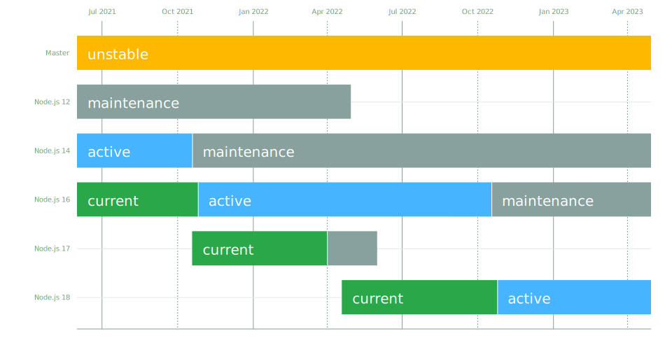
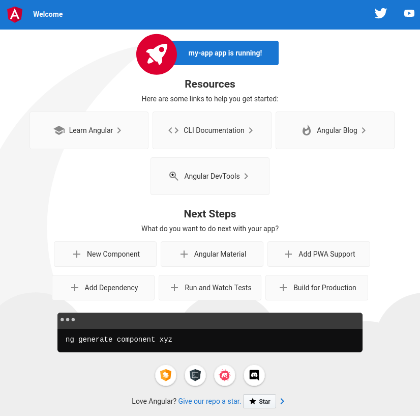

In diesem Lab wirst du Angular installieren.

Das Lab orientiert sich stark an der offiziellen Dokumentation von Angular. Die Dokumentation findest du  unter <a href="https://angular.io/docs" target="_blank">angular.io/docs</a>.

### Teil 1 - Installation von Node.js

In diesem ersten Schritt wirst du Node.js installieren, falls Node.js noch nicht bei dir installiert ist.

Überprüfe zuerst, ob Node.js bereits auf deinem System installiert ist:

```shell
node --version
```

Falls Node.js noch nicht auf deinem System installiert ist, kannst du Node.js über nvm (Node Version Manager) installieren.

Um nvm zu installieren, verwende das Skript```install.sh```, das sich innerhalb des repository <a href="https://github.com/nvm-sh/nvm" target="_blank">github.com/nvm-sh/nvm</a> befindet:

```shell
curl -o- https://raw.githubusercontent.com/nvm-sh/nvm/v0.39.0/install.sh | bash
```

Verwende den Befehl

```shell
nvm --version
```
um zu überprüfen, ob nvm richtig installiert wurde.

**nvm install**

Um eine spezifische Version```<x.y.z>```von Node.js zu installieren (Beispiel `12.22.7`), verwende den Befehl

```shell
nvm install <version>
```

Angular benötigt eine Active LTS (long-term support) oder eine Maintenance LTS Version von Node.js. Die aktuellen Active LTS und Maintenance LTS Versionen von Node.js sind unten abgebildet (Stand Oktober 2021), und unter <a href="https://nodejs.org/en/about/releases/" target="_blank">nodejs.org/en/about/releases</a> aufgelistet.

<br />



**nvm list**

Verwende den Befehl
```shell 
nvm list
```
um alle installierten Versionen von Node.js aufzulisten.


**nvm use**

Falls bereits eine Version von Node.js auf deinem System installiert war, und du nvm nachträglich installiert hast, kannst du mit dem Befehl

```shell
nvm use system
```

die bereits vorher installierte Version zur Verwendung auswählen.

Eine über nvm installierte Version <x.y.z> von Node.js kannst du mit
```shell
nvm use <x.y.z>
```
zur Verwendung auswählen.

**nvm alias default**

Zum Schluss, verwende

```shell
nvm alias default <version>
```

um eine mit Angular kompatible Version \<version\> (Beispiele ```system```, ```12.22.7```) von Node.js als Standard festzulegen.

---

Für die Installation von Angular im nächsten Schritt brauchst du den package mangager npm von Node.js. Stelle sicher, dass npm ebenfalls auf deinem System installiert ist:

```shell
npm --version
```

### Teil 2 - Installation des CLI von Angular

In diesem Schritt wirst du das CLI (command line interface) von Angular über npm installieren.

Verwende dazu den Befehl

```shell
npm install -g @angular/cli
```

Mit der Flag ```-g``` wird das CLI von Angular global installiert. Das heisst unter anderem, dass executables in einem Verzeichnis installiert oder referenziet werden, das in der Umgebungsvariablen ```PATH``` aufgelistet ist. Mehr Informationen dazu findest du <a href="https://nodejs.org/en/blog/npm/npm-1-0-global-vs-local-installation/" target="_blank">hier</a>.

Zur Überprüfung, ob Angular richtig installiert wurde, verwende

```shell
ng version
```

### Teil 3 - Erstellen einer App mit dem CLI

Das Grundgerüst einer Angular-App erstellt man mit dem Befehl ```ng new```.

Verwende den Befehl
```
ng new my-app
```

um eine neue App mit der Bezeichnung ```my-app``` zu erstellen.

Bei den zwei Eingabeaufforderungen / Prompts kannst du mit Enter die Standardoption bestätigen. Das CLI erstellt anschliessend ein Verzeichnis mit dem Namen ```my-app``` und den generierten Dateien.


### Teil 4 - Ausführen einer App mit dem CLI

Das CLI von Angular einthält einen Server, der eine App lokal bereitstellen kann.

Verwende innerhalb des mit dem CLI erstellten Verzeichnisses den Befehl

```shell
ng serve
```

um die in der letzten Aufgabe erstellte App zu builden und zu starten.

Mit der zusätzlichen Option```--open```öffnet das CLI die App direkt in einem Browser. Per default wird die App unter der Webadresse ```localhost:4200``` bereitgestellt.

Falls alles erfolgreich war, wird eine von Angular generierte Standardseite angezeigt. Die Seite ist unten abgebildet.

<br />




